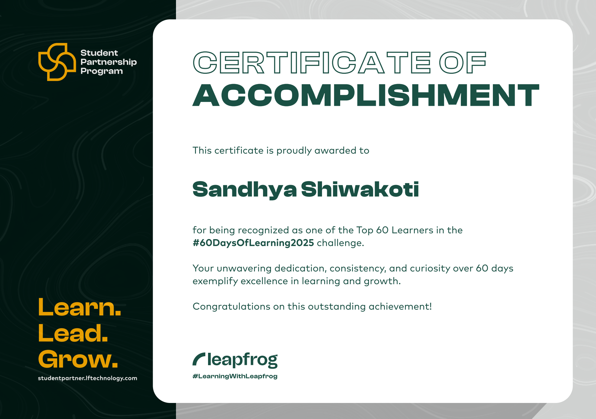

# 60 Days of JavaScript and React Learning Journey

This repository documents my progress and projects from the #60DaysOfLearning2025 challenge hosted by Leapfrog. Over 60 days, I focused on building a strong foundation in vanilla JavaScript and then moved on to building applications with React.

## Certificate

## Project Highlights

Here are a few of the key projects I built during this challenge.

### 1. Journey Portfolio
*   **Description:** A portfolio website to showcase the projects built throughout this 60-day journey.
*   **Technologies Used:** React, React Router

### 2. Pokémon Search App
*   **Description:** An application that allows users to search for a Pokémon and view its details by fetching data from the PokéAPI.
*   **Technologies Used:** React, Fetch API, Async/Await

### 3. Weather App
*   **Description:** A clean UI that displays the current weather for a city using a public weather API.
*   **Technologies Used:** JavaScript, HTML/CSS, API Integration

### 4. Mini Blog
*   **Description:** A simple blogging interface to practice CRUD (Create, Read, Update, Delete) operations.
*   **Technologies Used:** React, State Management (useState, useEffect)

## Skills Practiced
- Vanilla JavaScript (ES6+, DOM manipulation, Fetch API, Async/Await)
- React (Components, Props, State, Hooks, React Router)
- API Integration
- CRUD operations

---
You can explore the `JavaScript` and `React` folders to see all the daily exercises and smaller projects.
